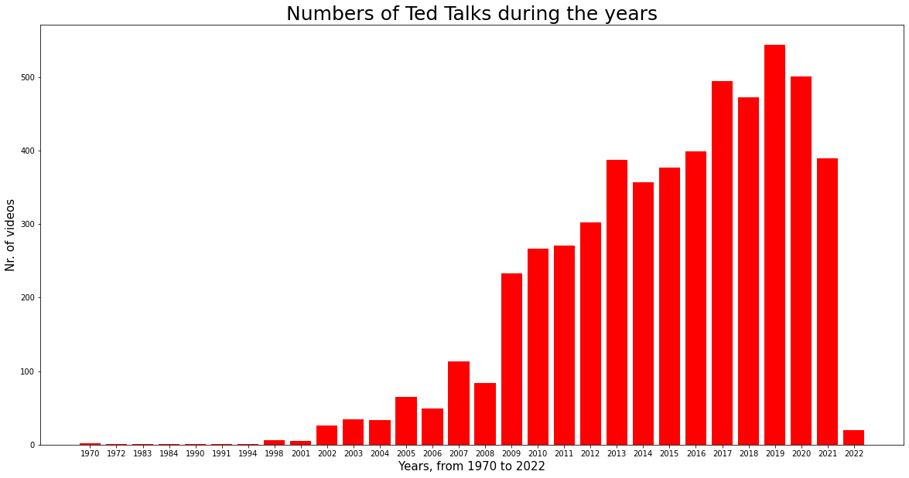

# TED Talks Analysis

A simple but interesting analysis on TED Talks videos published on TED Talks webite during the years.

## Description

I downloaded this data from Kaggle on Apr, 30th 2022. This is the link https://www.kaggle.com/datasets/ashishjangra27/ted-talks?resource=download.

The data has been scraped from the official TED Website by the creator of the dataset (Mr. Ashish Jangra) and was lastly updated in February 2022.

I used this dataset to perform an analysis in Python using different libraries:

+ Matplotlib
+ Seaborn
+ Numpy
+ Pandas

The database contains 5440 unique videos and for each one, we have available this data:

+ title - Title of the Talk
+ author - Author of Talk
+ date - Date when the talk took place
+ views - Number of views of the Talk
+ likes - Number of likes of the Talk
+ link - Link of the talk from ted.com

Based on this dataset, I firstly investigated how many videos are created each year.

In addition, I analyzed like and views distributions.

Furthermore, I discovered which is the most popular video, in terms of views and likes.

Lstly, I considered the authors to understand how many authors created videos for TED Talks and if there is someone that created more than 1 video.

### TED Talks history

TED is a nonprofit devoted to spreading ideas, usually in the form of short, powerful talks (18 minutes or less). TED began in 1984 as a conference where Technology, Entertainment and Design converged, and today covers almost all topics — from science to business to global issues — in more than 100 languages.

 

The first two video were created in 1970 and they are:
- Innovations in sleep, officially posted online in 2020;
- Love letters to what we hold dear, officially posted online in 2020.

The first TED Talks were posted online on June 27, 2006. By September, they had reached more than one million views. TED Talks proved so popular that in 2007, TED's website was relaunched around them, giving a global audience free access to some of the world's greatest thinkers, leaders and teachers.

### Comments

For any information, bugs, request or suggest ... feel free to contact me! :)

Thank you!
