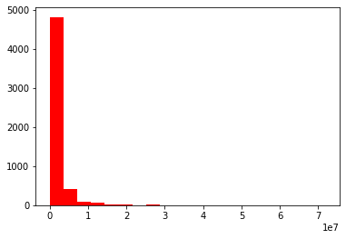
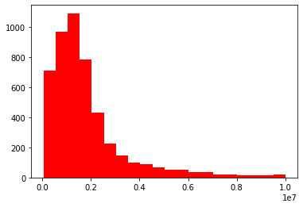
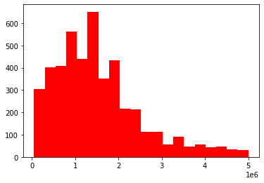
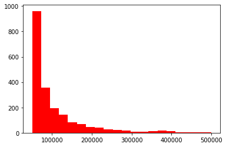
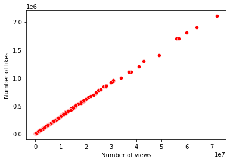

# Ted Talks Analysis

**First, I import the packages I need:**


```python
import pandas as pd
import matplotlib as plt
import numpy as np
```

### Import the data in DF


```python
ted_data = pd.read_csv('data.csv')
print(ted_data.head())
```

                                                   title                author  \
    0      Climate action needs new frontline leadership  Ozawa Bineshi Albert   
    1        The dark history of the overthrow of Hawaii         Sydney Iaukea   
    2     How play can spark new ideas for your business         Martin Reeves   
    3  Why is China appointing judges to combat clima...     James K. Thornton   
    4     Cement's carbon problem — and 2 ways to fix it       Mahendra Singhi   
    
                 date   views  likes  \
    0   December 2021  404000  12000   
    1   February 2022  214000   6400   
    2  September 2021  412000  12000   
    3    October 2021  427000  12000   
    4    October 2021    2400     72   
    
                                                    link  
    0  https://ted.com/talks/ozawa_bineshi_albert_cli...  
    1  https://ted.com/talks/sydney_iaukea_the_dark_h...  
    2  https://ted.com/talks/martin_reeves_how_play_c...  
    3  https://ted.com/talks/james_k_thornton_why_is_...  
    4  https://ted.com/talks/mahendra_singhi_cement_s...  


### I inspect the DF


```python
print(ted_data.shape)
print(ted_data.dtypes)
```

    (5440, 6)
    title     object
    author    object
    date      object
    views      int64
    likes      int64
    link      object
    dtype: object


I immediatly note that the date column is not in date format. In any case, I could separate the year in a specific column, in order to compare 2021 vs 2022 (or any other year).

### I separate month and year in two new columns


```python
ted_data['str_split'] = ted_data.date.str.split(' ')
ted_data['month'] = ted_data.str_split.str.get(0)
ted_data['year'] = ted_data.str_split.str.get(1)
ted_data.drop('str_split', axis=1, inplace=True)
print(ted_data.head())
```

                                                   title                author  \
    0      Climate action needs new frontline leadership  Ozawa Bineshi Albert   
    1        The dark history of the overthrow of Hawaii         Sydney Iaukea   
    2     How play can spark new ideas for your business         Martin Reeves   
    3  Why is China appointing judges to combat clima...     James K. Thornton   
    4     Cement's carbon problem — and 2 ways to fix it       Mahendra Singhi   
    
                 date   views  likes  \
    0   December 2021  404000  12000   
    1   February 2022  214000   6400   
    2  September 2021  412000  12000   
    3    October 2021  427000  12000   
    4    October 2021    2400     72   
    
                                                    link      month  year  
    0  https://ted.com/talks/ozawa_bineshi_albert_cli...   December  2021  
    1  https://ted.com/talks/sydney_iaukea_the_dark_h...   February  2022  
    2  https://ted.com/talks/martin_reeves_how_play_c...  September  2021  
    3  https://ted.com/talks/james_k_thornton_why_is_...    October  2021  
    4  https://ted.com/talks/mahendra_singhi_cement_s...    October  2021  


## 1. How many videos are created each year?


```python
ted_data_year = ted_data.groupby('year').title.count().reset_index()
print(ted_data_year)
```

        year  title
    0   1970      2
    1   1972      1
    2   1983      1
    3   1984      1
    4   1990      1
    5   1991      1
    6   1994      1
    7   1998      6
    8   2001      5
    9   2002     26
    10  2003     34
    11  2004     33
    12  2005     65
    13  2006     49
    14  2007    113
    15  2008     84
    16  2009    233
    17  2010    267
    18  2011    271
    19  2012    302
    20  2013    388
    21  2014    357
    22  2015    377
    23  2016    399
    24  2017    495
    25  2018    473
    26  2019    544
    27  2020    501
    28  2021    390
    29  2022     20


When I inspected the first rows of the DF, I never could imagine that there were many videos older than 2 years ago. First videos on TED Talks were created in 1970.
Interesting thing is that until 2010, the production of videos of TED Talks was not so high and in many years no videos were published.
This is a table, but how does it appear if I plot this data?


```python
from matplotlib import pyplot as plt
plt.figure(figsize = (20, 10))
plt.bar(ted_data_year.year, ted_data_year.title, color = 'red')
plt.title('Numbers of Ted Talks during the years', fontsize = 25)
plt.xlabel('Years, from 1970 to 2022', fontsize = 15)
plt.ylabel('Nr. of videos', fontsize = 15)
plt.show()
```


    

    


## 2. Like and views distributions

How are likes and views distributions? Normal distributions? Skewed (left or right)? Let's investigate...


```python
plt.hist(ted_data.views, bins = 20, color = 'red')
plt.show()
```


    

    


I immediatly note that most videos have between 0 and 10.000.000 views, but this histogram is not clear, because there are many outliers. So, I create an histogram only taking the more popular portion of dataset.


```python
plt.hist(ted_data.views, bins = 20, range = (50000, 10000000), color = 'red')
plt.show()
```


    

    


I've analyzed only videos from 50k to 5 million views. In any case, the distribution is skew-right and is not unimodal, because we can see 3 peaks.


```python
plt.hist(ted_data.views, bins = 20, range = (50000, 5000000), color = 'red')
plt.show()
```


    

    


```python
plt.hist(ted_data.likes, bins = 20, color = 'red')
plt.show()
```


    

    


I notice that we have the same "problem" with likes. Most videos have between 0 and 500.000 likes, but this histogram is not clear, because there are many outliers. So, I create an histogram only taking the more popular portion of dataset.


```python
plt.hist(ted_data.likes, bins = 20, range = (50000, 500000), color = 'red')
plt.show()
```


    

    


I've analyzed only videos from 0 to 500k likes. In any case, the distribution is skew-right but is unimodal. In fact, most videos have up to 50.000 likes and are in the first bin of the histogram.

I can invest if there is a relationship between the number of views and number of likes of a TED Talks videos. Is there?


```python
import seaborn as sns
sns.scatterplot(data = ted_data, x = 'views', y = 'likes', color = 'red')
plt.xlabel('Number of views')
plt.ylabel('Number of likes')
plt.show()
```


    

    


It's clear that YES, there is a linear relationship between the two variables. Most views, most likes.
It could be confirmed with covariance calculations:


```python
cov_views_likes = np.cov(ted_data.views, ted_data.likes)
print(cov_views_likes)
```

    [[1.27241865e+13 3.83856396e+11]
     [3.83856396e+11 1.15878270e+10]]


```python
from scipy.stats import pearsonr
corr_views_likes, p = pearsonr(ted_data.views, ted_data.likes)
print(corr_views_likes)
```

    0.9996610444062042


As we can see in both calculations, there is a STRONG linear relationship between the two variables, as already viewed in the scatterplot.

## 3. Which is the most popular video?


```python
best_video_views = ted_data.views.max()

best_video_title = ted_data[ted_data.views == ted_data.views.max()].reset_index()

print('The video with most views has ', best_video_views, ' views and it is: ')
print(best_video_title)
```

    The video with most views has  72000000  views and it is: 
       index                        title            author           date  \
    0   5436  Do schools kill creativity?  Sir Ken Robinson  February 2006   
    
          views    likes                                               link  \
    0  72000000  2100000  https://ted.com/talks/sir_ken_robinson_do_scho...   
    
          month  year  
    0  February  2006  


How many views has the most viewed video each year?


```python
best_video_per_year = ted_data.groupby('year').views.max().reset_index()
print(best_video_per_year)
```

        year     views
    0   1970    192000
    1   1972   1300000
    2   1983    690000
    3   1984   1100000
    4   1990    723000
    5   1991    327000
    6   1994    699000
    7   1998   3800000
    8   2001   7000000
    9   2002   6400000
    10  2003   7100000
    11  2004  19000000
    12  2005  16000000
    13  2006  72000000
    14  2007  16000000
    15  2008  28000000
    16  2009  57000000
    17  2010  56000000
    18  2011  31000000
    19  2012  64000000
    20  2013  49000000
    21  2014  22000000
    22  2015  43000000
    23  2016  60000000
    24  2017  28000000
    25  2018  14000000
    26  2019  15000000
    27  2020   8600000
    28  2021  10000000
    29  2022   2300000


But... which videos are these? I use SQL in Python to investigate...


```python
import sqldf
query = """
SELECT title, author, year, MAX(views) FROM ted_data
GROUP BY year
ORDER BY MAX(views) desc;
"""
df_view = sqldf.run(query)
print(df_view)
```

                                                    title               author  \
    0                         Do schools kill creativity?     Sir Ken Robinson   
    1            Your body language may shape who you are            Amy Cuddy   
    2          Inside the mind of a master procrastinator            Tim Urban   
    3                    How great leaders inspire action          Simon Sinek   
    4                          The power of vulnerability          Brené Brown   
    5          How to speak so that people want to listen      Julian Treasure   
    6                  The next outbreak? We're not ready           Bill Gates   
    7                                  How to spot a liar         Pamela Meyer   
    8              The future we're building — and boring            Elon Musk   
    9                                My stroke of insight    Jill Bolte Taylor   
    10                         The Infinite Hotel Paradox        Jeff Dekofsky   
    11                The surprising science of happiness          Dan Gilbert   
    12                           Underwater astonishments          David Gallo   
    13                              The paradox of choice       Barry Schwartz   
    14                           Sleep is your superpower          Matt Walker   
    15                 How do cigarettes affect the body?       Krishna Sudhir   
    16  What causes dandruff, and how do you get rid o...     Thomas L. Dawson   
    17    How we must respond to the coronavirus pandemic           Bill Gates   
    18                    How to get your ideas to spread           Seth Godin   
    19      The difference between winning and succeeding          John Wooden   
    20                                   Militant atheism      Richard Dawkins   
    21                            On technology and faith         Billy Graham   
    22                  Why do cats have vertical pupils?           Emma Bryce   
    23                              Why believe in others        Viktor Frankl   
    24                           5 predictions, from 1984  Nicholas Negroponte   
    25                           My days as a young rebel          Frank Gehry   
    26                       Back to the future (of 1994)         Danny Hillis   
    27                          Physics is fun to imagine      Richard Feynman   
    28                         Growing up in the universe      Richard Dawkins   
    29                  Love letters to what we hold dear       Debbie Millman   
    
        year  MAX(views)  
    0   2006    72000000  
    1   2012    64000000  
    2   2016    60000000  
    3   2009    57000000  
    4   2010    56000000  
    5   2013    49000000  
    6   2015    43000000  
    7   2011    31000000  
    8   2017    28000000  
    9   2008    28000000  
    10  2014    22000000  
    11  2004    19000000  
    12  2007    16000000  
    13  2005    16000000  
    14  2019    15000000  
    15  2018    14000000  
    16  2021    10000000  
    17  2020     8600000  
    18  2003     7100000  
    19  2001     7000000  
    20  2002     6400000  
    21  1998     3800000  
    22  2022     2300000  
    23  1972     1300000  
    24  1984     1100000  
    25  1990      723000  
    26  1994      699000  
    27  1983      690000  
    28  1991      327000  
    29  1970      192000  


And, what about the most liked videos for each year? Let's see...


```python
query = """
SELECT title, author, year, MAX(likes) FROM ted_data
GROUP BY year
ORDER BY MAX(views) desc;
"""
df_like = sqldf.run(query)
print(df_like)
```

                                                    title               author  \
    0                         Do schools kill creativity?     Sir Ken Robinson   
    1            Your body language may shape who you are            Amy Cuddy   
    2          Inside the mind of a master procrastinator            Tim Urban   
    3                    How great leaders inspire action          Simon Sinek   
    4                          The power of vulnerability          Brené Brown   
    5          How to speak so that people want to listen      Julian Treasure   
    6                  The next outbreak? We're not ready           Bill Gates   
    7                                  How to spot a liar         Pamela Meyer   
    8              The future we're building — and boring            Elon Musk   
    9                                My stroke of insight    Jill Bolte Taylor   
    10                         The Infinite Hotel Paradox        Jeff Dekofsky   
    11                The surprising science of happiness          Dan Gilbert   
    12                           Underwater astonishments          David Gallo   
    13                              The paradox of choice       Barry Schwartz   
    14                           Sleep is your superpower          Matt Walker   
    15                 How do cigarettes affect the body?       Krishna Sudhir   
    16  What causes dandruff, and how do you get rid o...     Thomas L. Dawson   
    17    How we must respond to the coronavirus pandemic           Bill Gates   
    18                    How to get your ideas to spread           Seth Godin   
    19      The difference between winning and succeeding          John Wooden   
    20                                   Militant atheism      Richard Dawkins   
    21                            On technology and faith         Billy Graham   
    22                  Why do cats have vertical pupils?           Emma Bryce   
    23                              Why believe in others        Viktor Frankl   
    24                           5 predictions, from 1984  Nicholas Negroponte   
    25                           My days as a young rebel          Frank Gehry   
    26                       Back to the future (of 1994)         Danny Hillis   
    27                          Physics is fun to imagine      Richard Feynman   
    28                         Growing up in the universe      Richard Dawkins   
    29                  Love letters to what we hold dear       Debbie Millman   
    
        year  MAX(likes)  
    0   2006     2100000  
    1   2012     1900000  
    2   2016     1800000  
    3   2009     1700000  
    4   2010     1700000  
    5   2013     1400000  
    6   2015     1300000  
    7   2011      953000  
    8   2017      849000  
    9   2008      844000  
    10  2014      671000  
    11  2004      598000  
    12  2007      490000  
    13  2005      501000  
    14  2019      450000  
    15  2018      435000  
    16  2021      315000  
    17  2020      259000  
    18  2003      214000  
    19  2001      210000  
    20  2002      192000  
    21  1998      116000  
    22  2022       70000  
    23  1972       41000  
    24  1984       33000  
    25  1990       21000  
    26  1994       20000  
    27  1983       20000  
    28  1991        9800  
    29  1970        5700  


### 4. What about the authors? How many authors created videos TED Talks? Are someone created more than 1 video?


```python
authors = ted_data.groupby('author').title.count().reset_index()
authors = authors.sort_values(by=['title'], ascending=False)
print(authors)
```

                    author  title
    148       Alex Gendler     45
    1781  Iseult Gillespie     33
    2845       Matt Walker     18
    152     Alex Rosenthal     15
    1283     Elizabeth Cox     13
    ...                ...    ...
    1582        Gill Hicks      1
    1583      Gillian Gibb      1
    1584      Gina Brillon      1
    1585        Gina Cooke      1
    4442       Özlem Cekic      1
    
    [4443 rows x 2 columns]


We can see that there are only 4.443 authors that globally created 5.440 videos.
Many of them, created only few videos (up to 5) and few of them created more than 5 videos.
Let's investigate...


```python
authors_1_5 = authors.loc[authors['title'] < 6]
print(authors_1_5)
```

                            author  title
    3991            Steven Johnson      5
    2457  Kristen Bell + Giant Ant      5
    1423                Eve Ensler      5
    3145       Nicholas Negroponte      5
    3902          Sir Ken Robinson      5
    ...                        ...    ...
    1582                Gill Hicks      1
    1583              Gillian Gibb      1
    1584              Gina Brillon      1
    1585                Gina Cooke      1
    4442               Özlem Cekic      1
    
    [4416 rows x 2 columns]


That's the situations: 4.416 authors created at least 1 but no more than 5 videos.


```python
authors_more_5 = authors.loc[authors['title'] > 5]
print(authors_more_5)
```

                        author  title
    148           Alex Gendler     45
    1781      Iseult Gillespie     33
    2845           Matt Walker     18
    152         Alex Rosenthal     15
    1283         Elizabeth Cox     13
    1338            Emma Bryce     12
    962          Daniel Finkel     11
    2216         Juan Enriquez     11
    933             Dan Finkel      9
    1655          Hans Rosling      9
    4338      Wendy De La Rosa      9
    1609             Greg Gage      9
    3029          Mona Chalabi      9
    1962            Jen Gunter      9
    544             Bill Gates      8
    2729         Marco Tempest      7
    31                  TED-Ed      7
    943           Dan Kwartler      7
    1821  Jacqueline Novogratz      6
    2213               Joy Lin      6
    923             Dan Ariely      6
    1433         Fabio Pacucci      6
    3557                 Rives      6
    3930   Soraya Field Fiorio      6
    111                Al Gore      6
    776         Chris Anderson      6
    40             A.J. Jacobs      6


27 authors created more than 5 videos. We can notice that the most productive author is Alex Gendler that created 45 videos!
